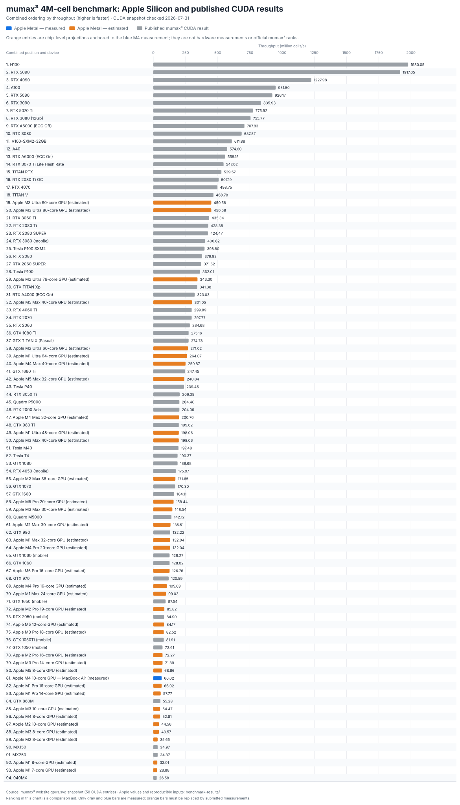

<!-- markdownlint-disable MD033 -->

# mumax³

**GPU-accelerated micromagnetism.**

> [!IMPORTANT]
> **This fork adds a native Apple Silicon / Metal backend.** Unlike upstream
> mumax³, it can run simulations directly on the integrated GPU in an
> Apple-silicon MacBook, iMac, Mac mini, or Mac Studio—without an NVIDIA GPU,
> CUDA, a virtual machine, or a remote Linux host. Existing Linux/Windows CUDA
> builds remain available and use the original CUDA implementation.

The macOS backend keeps the `.mx3` language and mumax³'s high-level Go API
unchanged. CUDA-driver-specific `cuda/cu` module and raw-launch APIs remain
available only on the CUDA backend.
At build time, `darwin/arm64` selects Metal compute kernels, an MPSGraph
real-to-complex FFT compatible with the cuFFT layout used by the demagnetizing
field convolution, and a Philox thermal-noise generator. GPU allocations use
Apple's unified memory, commands are batched on one ordered Metal queue, and
32-wide X-contiguous SIMD tiles are sized for Apple GPUs.

| Host | GPU backend | Extra GPU toolkit |
|---|---|---|
| Apple Silicon + macOS 14 or newer | Metal / MPSGraph | None (shaders compile through Metal at runtime) |
| Linux or Windows + NVIDIA GPU | CUDA / cuFFT / cuRAND | NVIDIA driver and CUDA toolkit |
| Intel Mac | Not supported by the Metal backend | — |

Paper on the design and verification of MuMax3: <http://scitation.aip.org/content/aip/journal/adva/4/10/10.1063/1.4899186>

<!-- [](https://travis-ci.org/mumax/3) -->

## Apple Silicon one-command install

The installer supports an M1 or newer Apple-silicon Mac running macOS 14
Sonoma or newer. On a fresh Mac, open Terminal and run:

```bash
/bin/bash -c "$(/usr/bin/curl -fsSL https://raw.githubusercontent.com/TaewoooPark/mumax3-for-mac/master/install-macos.sh)"
```

This single entry point:

1. Rejects Intel Macs, Rosetta terminals, and unsupported macOS versions.
2. Opens the Apple Command Line Tools installer when `clang`, `git`, or `make`
   is missing, then waits for it to finish.
3. Installs native Apple-silicon Homebrew and Go 1.22.4 or newer when needed.
4. Clones the repository to `~/mumax3-for-mac`, or reuses the checkout when the
   script is run locally.
5. Builds the Metal backend, adds the Go binary directory to `~/.zprofile`, and
   runs `mumax3 -test`.

The Command Line Tools installer opens a macOS window, and Homebrew may request
an administrator password. The script is safe to run again: completed
dependencies are reused, and an existing unrelated source directory is never
overwritten. Run `./install-macos.sh --help` for source-directory and shell
profile options.

To inspect the installer before running it:

```bash
/usr/bin/curl -fsSLo /tmp/mumax3-install-macos.sh \
  https://raw.githubusercontent.com/TaewoooPark/mumax3-for-mac/master/install-macos.sh
less /tmp/mumax3-install-macos.sh
/bin/bash /tmp/mumax3-install-macos.sh
```

When installing from an existing checkout, use:

```bash
./install-macos.sh
```

After installation, open a new Terminal or run `source ~/.zprofile`.

## Running a simulation on macOS

### Live Web UI (default)

Run an ordinary mumax³ input file without an `-http` flag:

```bash
mumax3 example.mx3
```

This starts the simulation and the live Web UI on
<http://127.0.0.1:35367>. Open that address manually if the browser does not
open automatically. You can inspect the magnetization and progress while the
simulation is running; normal output is also written to `example.out/`.

To use another port:

```bash
mumax3 -http=":35368" example.mx3
```

### Headless or batch execution

Disable the Web UI explicitly for scripts, remote shells, benchmarks, or batch
runs:

```bash
mumax3 -http="" example.mx3
```

Both modes run the same simulation and write the same result directory. The
startup banner identifies `Metal` and the selected Apple GPU. `-gpu` is
accepted for CLI compatibility but Apple Silicon exposes one system-default
Metal device. Use `-sync` only for debugging; it forces synchronization after
each GPU call and substantially reduces performance. Do not install CUDA on a
Mac. The full Xcode application and the offline `metal`/`metallib` commands are
not required because the generated shaders can compile at runtime.

For a repeatable developer check, run:

```bash
make check-metal
```

This verifies all generated Metal wrappers, statically compiles the complete
shader library when the offline Metal compiler is present, runs the Go and GPU
numerical tests (including FFT round trips and Philox statistics), and builds
the command-line tools. With Command Line Tools alone, shader compilation is
verified through the same runtime path used by mumax³.

### Numerical compatibility

The Metal path preserves mumax³'s single-precision model and cuFFT-compatible
packed R2C/C2R layout. Parallel reductions can differ in their last few bits
because GPU accumulation order is not deterministic. Thermal simulations use
Philox rather than cuRAND's default XORWOW sequence, so equal seeds are
reproducible on Metal but do not produce the same samples as CUDA; unlike
cuRAND normal generation, the Metal path also accepts odd cell counts. One Hopf
summand that used double-complex intermediates in CUDA uses `float2` on Apple
GPUs, which do not provide native FP64; its output is checked with an explicit
floating-point tolerance rather than bit-for-bit comparison.

On the current Apple M4 build, **15/15 non-thermal upstream CUDA-era physics
tests and 103/103 assertions passed: 100.000% conformance within the original
upstream tolerances**. Across the 10 dimensionless average-magnetization vectors
in those tests, Metal achieved **99.9923% mean normalized-L2 agreement** with
the embedded upstream reference vectors; the lowest individual result was
**99.9415%**. The vector metric is
`100 × (1 - ||m_Metal - m_reference||₂ / ||m_reference||₂)`.

These are numerical-conformance measurements, not a claim of bit-for-bit
identity. The GTX 1050 mobile and GTX 860M identify the M4's neighboring
throughput class in the official benchmark chart, but no same-commit raw
physics output from either card is published, and a Mac cannot execute the
CUDA backend locally. The comparison therefore uses unchanged tests and
reference values from the upstream CUDA-only codebase; those references mix
historical mumax³ goldens, analytic invariants, and independent OOMMF values.
See the [full method, test cohort, statistics, and per-vector data](physics-validation-results/apple-m4-cuda-era-20260731/).

## Verified examples and performance

The repository includes the exact 15 scripts from the
[official examples page](https://mumax.github.io/examples.html), their complete
Apple M4 execution outputs, logs, and license/attribution:

- [Working examples and results](examples-and-results/)
- [15/15 execution report](examples-and-results/RESULTS.md)
- [Official example source and GPL-3.0-or-later license](examples-and-results/SOURCE_AND_LICENSE.md)

The official 4-million-cell benchmark produced a 5-run median of
**66.02 M cells/s** on the tested 10-core-GPU M4 MacBook Air. Inserted into the
CUDA ranking currently published on the mumax³ website, it falls between the
GTX 1050 mobile and GTX 860M: **55th out of 59 entries after insertion**.
See the [benchmark method, raw runs, and interpretation](benchmark-results/apple-m4-macbook-air-20260731/).



The chart uses **blue for measured Apple Metal**, **orange for calculated Apple
Silicon projections**, and **gray for all 58 CUDA results in the mumax³ website
snapshot**. Its position numbers sort all three categories together by
throughput for visual comparison; they are not an official mumax³ ranking.
Only the blue and gray bars are measurements.

<details>
<summary><strong>Estimated benchmark calculation method and references</strong></summary>

The orange values use a deliberately simple, reproducible balanced-roofline
projection. The only calibration point is the measured M4 10-core-GPU median:

```text
T₀ = 66.0187366513 million cells/s
B₀ = 120 GB/s
Rcompute = target graphics-performance proxy / M4 graphics-performance proxy
Rbandwidth = target unified-memory bandwidth / 120 GB/s
Ttarget = T₀ × min(Rcompute, Rbandwidth)
```

`Rcompute` comes from Apple's published, non-AI graphics-performance ratios.
For a binned GPU from the same chip family, the ratio is scaled linearly by its
active GPU-core count. `Rbandwidth` uses Apple's published unified-memory
bandwidth. Taking the smaller ratio prevents either nominal shader capacity or
memory bandwidth from being counted twice. Neural Accelerator/Neural Engine
claims and ray-tracing-only gains are excluded because the current Metal
backend uses ordinary FP32 compute kernels and MPSGraph FFTs, not those units.

This is a chip-level estimate for the same 4-million-cell workload, not a
measurement of any Mac model. It assumes unchanged backend efficiency, FFT
selection, fixed overhead, cooling, and sustained clocks. A MacBook Air,
MacBook Pro, Mac mini, iMac, and Mac Studio with the same chip can therefore
produce different measured results. The method is intended to rank candidates
for real testing, not to replace that testing.

Machine-readable inputs and per-chip source mappings are in
[`apple-silicon-estimates.json`](benchmark-results/apple-silicon-estimates.json).
The SVG is regenerated from those inputs, the measurement
[`registry.json`](benchmark-results/registry.json), and the frozen CUDA website
snapshot by running `go run ./benchmark-results/tools/chart`. The limiting
`min(compute, bandwidth)` structure follows the
[Roofline performance model](https://doi.org/10.1145/1498765.1498785).

Primary sources:

- mumax³: [official benchmark input](https://github.com/mumax/3/blob/master/bench/bench.mx3), [published GPU chart](https://mumax.github.io/gpus.svg), and [website](https://mumax.github.io/)
- Metal: [Metal Performance Primitives Programming Guide](https://developer.apple.com/download/files/Metal-Performance-Primitives-Programming-Guide.pdf) and [GPU memory-bandwidth measurement](https://developer.apple.com/documentation/xcode/measuring-the-gpus-use-of-memory-bandwidth)
- M1 family: [M1 Pro and M1 Max](https://www.apple.com/newsroom/2021/10/introducing-m1-pro-and-m1-max-the-most-powerful-chips-apple-has-ever-built/) and [M1 Ultra](https://www.apple.com/newsroom/2022/03/apple-unveils-m1-ultra-the-worlds-most-powerful-chip-for-a-personal-computer/)
- M2 family: [M2](https://www.apple.com/ie/newsroom/2022/06/apple-unveils-m2-with-breakthrough-performance-and-capabilities/), [M2 Pro and M2 Max](https://www.apple.com/newsroom/2023/01/apple-unveils-macbook-pro-featuring-m2-pro-and-m2-max/), and [M2 Ultra](https://www.apple.com/uk/newsroom/2023/06/apple-introduces-m2-ultra/)
- M3 family: [M3, M3 Pro, and M3 Max](https://www.apple.com/ae/newsroom/2023/10/apple-unveils-m3-m3-pro-and-m3-max-the-most-advanced-chips-for-a-personal-computer/), [M3 Pro/Max specifications](https://support.apple.com/en-us/117737), [M3 Ultra](https://www.apple.com/mu/newsroom/2025/03/apple-reveals-m3-ultra-taking-apple-silicon-to-a-new-extreme/), and [M3 Ultra specifications](https://support.apple.com/en-us/122211)
- M4 family: [M4, M4 Pro, and M4 Max](https://www.apple.com/newsroom/2024/10/apple-introduces-m4-pro-and-m4-max/) and [M4 Pro/Max specifications](https://support.apple.com/en-us/121554)
- M5 family: [M5](https://www.apple.com/ca/newsroom/2025/10/apple-unleashes-m5-the-next-big-leap-in-ai-performance-for-apple-silicon/), [M5 Pro and M5 Max](https://www.apple.com/newsroom/2026/03/apple-debuts-m5-pro-and-m5-max-to-supercharge-the-most-demanding-pro-workflows/), and [current M5-family specifications](https://www.apple.com/macbook-pro/specs/)
- Base-chip configurations: [M1 Air](https://support.apple.com/en-us/111883), [M2 Air](https://support.apple.com/en-us/111867), [M3 Air](https://support.apple.com/en-us/118551), [M4 Air](https://support.apple.com/en-us/122209), and [current M5 Air specifications](https://www.apple.com/macbook-air/specs/)

</details>

### Benchmark submissions welcome

Have another Apple Silicon Mac? Run the exact five-run protocol and open a PR.
The repository provides a non-overwriting runner, metadata template, statistics
tool, review checklist, and a registry that automatically replaces a matching
orange projection with a blue measurement. Start with the
[benchmark submission guide](benchmark-results/submissions/).

## Downloads and documentation

👉 Pre-compiled binaries, examples, and documentation are available on the [mumax³ homepage](https://mumax.github.io).

Documentation of several tools, like `mumax3-convert`, is available [here](https://godoc.org/github.com/mumax/3/cmd).

## Contributing

Contributions are gratefully accepted. To contribute code, fork our GitHub repo and send a pull request.

## Existing CUDA users

The original NVIDIA CUDA backend remains available on supported Linux and
Windows hosts. Its upstream installation guide is retained below for existing
CUDA users.

<details>
<summary><strong>Show the original Linux/Windows CUDA installation guide</strong></summary>

### Building the CUDA backend from source

Consider downloading a [pre-compiled mumax³ binary](https://mumax.github.io/download.html).

The instructions below apply to the original NVIDIA CUDA backend on Linux and
Windows. For a Mac, use the Apple Silicon one-command install above.

If you want to compile the CUDA backend, 4 essential components will be required to build mumax³: an ***NVIDIA driver***, ***Go***, ***CUDA*** (&leq;12.9) and ***C***.

* *If they are not yet present on your system*: install them as detailed below.
* *If they are already installed*: check if they work correctly by running the *check* for each component written below.

Click on the arrows below to expand the installation instructions:<br><sub><sup>These instructions were made for Windows 10 and Ubuntu 22.04 (but should be applicable to all Debian systems). Your mileage may vary.</sup></sub>

<details><summary><b><i>Install an NVIDIA driver</i></b></summary>

* **Windows**: Find a suitable driver [here](https://www.nvidia.com/en-us/drivers/).
* **Linux**: [Install the NVIDIA proprietary driver](https://www.nvidia.com/en-us/drivers/unix/). <!-- version 440.44 recommended --><details><summary>Troubleshooting Linux &rarr;click here&larr;</summary>
  If the following error occurs, proceed as follows:

  ```batch
  nvidia-smi has failed because it couldn't communicate with the NVIDIA driver. Make sure that the latest NVIDIA driver is installed and running
  ```

  1) Check for existing NVIDIA drivers.
      * Run `dpkg -l | grep nvidia` to see if any NVIDIA drivers are installed.
      * If it shows some drivers, you might want to uninstall them before proceeding with the clean installation: `sudo apt-get --purge remove '*nvidia*'`
  2) Update system packages. Make sure your system is up to date with `sudo apt update` and `sudo apt upgrade`.
  3) (Optional but recommended:) Add the official NVIDIA PPA to ensure you have access to the latest NVIDIA drivers with `sudo add-apt-repository ppa:graphics-drivers/ppa` and `sudo apt update`.
  4) Install the recommended driver. Ubuntu can automatically detect and recommend the right NVIDIA driver for your system with the command `ubuntu-drivers devices`. This will list the available drivers for your GPU and mark the recommended one. <br> To install the recommended NVIDIA driver, use `sudo apt install nvidia-driver-<version>` (replace `<version>` with the number of the recommended driver e.g., nvidia-driver-535)
  5) Reboot your system with `sudo reboot` to apply the changes.

  6) Verify the installation with `nvidia-smi`. This returns something like this, which shows you the driver version in the top center:

  ```bash
      +-----------------------------------------------------------------------------------------+
      | NVIDIA-SMI 552.22                 Driver Version: 552.22         CUDA Version: 12.4     |
      |-----------------------------------------+------------------------+----------------------+
      | GPU  Name                     TCC/WDDM  | Bus-Id          Disp.A | Volatile Uncorr. ECC |
      | Fan  Temp   Perf          Pwr:Usage/Cap |           Memory-Usage | GPU-Util  Compute M. |
      |                                         |                        |               MIG M. |
      |=========================================+========================+======================|
      |   0  NVIDIA GeForce RTX 3080 ...  WDDM  |   00000000:01:00.0 Off |                  N/A |
      | N/A   53C    P8              9W /  115W |     257MiB /   8192MiB |      0%      Default |
      |                                         |                        |                  N/A |
      +-----------------------------------------+------------------------+----------------------+

      +-----------------------------------------------------------------------------------------+
      | Processes:                                                                              |
      |  GPU   GI   CI        PID   Type   Process name                              GPU Memory |
      |        ID   ID                                                               Usage      |
      |=========================================================================================|
      |    0   N/A  N/A     28420    C+G   ...Programs\Microsoft VS Code\Code.exe      N/A      |
      |    0   N/A  N/A     31888    C+G   ...les\Microsoft OneDrive\OneDrive.exe      N/A      |
      +-----------------------------------------------------------------------------------------+
  ```

  </details>
* **WSL**: Follow the instructions and troubleshooting for Linux above. If you encounter issues/errors during that process, see the troubleshooting section below: <details><summary>Troubleshooting WSL &rarr;click here&larr;</summary>
    When using Windows Subsystem for Linux, your graphics card might not be recognized. If an error occurs after running the command:

    1) If `ubuntu-drivers devices` throws the error
        * `Command 'ubuntu-drivers' not found`: run the command `sudo apt install ubuntu-drivers-common`.
        * `ERROR:root:aplay command not found`: run the command `sudo apt install alsa-utils`.
    2) If `sudo apt install nvidia-driver-<version>` throws the error `E: Unable to locate package nvidia-driver-<version>`: run the commands

        ```bash
        sudo apt install software-properties-gtk
        sudo add-apt-repository universe
        sudo add-apt-repository multiverse
        sudo apt update
        sudo apt install nvidia-driver-<version> 
        ```

    3) If `nvidia-smi` throws the error `nvidia: command not found`: the controller is probably not using the correct interface (`sudo lshw -c display` should show NVIDIA). To solve this, follow [these steps](https://learn.microsoft.com/en-us/windows/wsl/tutorials/gpu-compute). If a `docker: permission denied` error occurs: close and re-open WSL.

  </details>

👉 *Check NVIDIA driver installation with: `nvidia-smi`*

</details>

<details><summary><b><i>Install CUDA</i></b> &leq;12.9</summary>

* **Windows**: Download an installer from [the CUDA website](https://developer.nvidia.com/cuda-downloads).
  * ⚠️ **To be on the safe side, it is recommended to install CUDA in a directory without spaces, like `C:\cuda`.** Spaces should not cause issues when running `deploy_windows.ps1`, but this is not guaranteed.
* **Linux**: Use `sudo apt-get install nvidia-cuda-toolkit`, or [download an installer](https://developer.nvidia.com/cuda-downloads).
  * Pick the default installation path. **If this is not `usr/local/cuda/`, create a symlink to that path.**
  * Match the version shown in your driver (see top right in `nvidia-smi` output).
  * When prompted what to install: do not install the driver again, only the CUDA toolkit.
  * Add the CUDA `bin` and `lib64` paths to your `PATH` and `LD_LIBRARY_PATH` by adding the following lines at the end of your shell profile file (usually `.bashrc` for Bash):

    ```bash
    export PATH=/usr/local/cuda/bin:$PATH
    export LD_LIBRARY_PATH=/usr/local/cuda/lib64:$LD_LIBRARY_PATH
    ```

    Apply the changes with `source ~/.bashrc`.

👉 *Check CUDA installation with: `nvcc --version`*

</details>

<details><summary><b><i>Install Go</i></b></summary>

* Download and install from [the Go website](https://go.dev/doc/install).
* The `GOPATH` environment variable should have been set automatically (note: the folder it points to probably doesn't exist yet).<br>*Check with `go env GOPATH`.* <details><summary><i>Click here to set `GOPATH` manually if it does not exist.</i></summary>
  * On **Windows:** `%USERPROFILE%/go` is often used, e.g. `C:/Users/<name>/go`. See [this guide](https://www.wikihow.com/Change-the-PATH-Environment-Variable-on-Windows) if you are unfamiliar with environment variables.
  * On **Linux:** `~/go` is often used. Open or create the `~/.bashrc` file and add the following lines.

    ```bash
    export GOPATH=$HOME/go
    export PATH=$GOPATH/bin:$PATH
    ```

    After editing the file, apply the changes by running `source ~/.bashrc`.
    </details>

👉 *Check Go installation with: `go version`*

</details>

<details><summary><b><i>Install a C compiler</i></b></summary>

* **Linux:** `sudo apt-get install gcc`
  * ⚠️ each CUDA version has a maximum supported `gcc` version. [This StackOverflow answer](https://stackoverflow.com/a/46380601) lists the maximum supported `gcc` version for each CUDA version. If necessary, use `sudo apt-get install gcc-<min_version>` instead, with the appropriate `<min_version>`.
* **Windows:**
  * CUDA does not support the `gcc` compiler on Windows, so download and install [Visual Studio](https://visualstudio.microsoft.com/downloads/) with the "Desktop development with C++" workload.  After installing, check if the path to `cl.exe` was added to your `PATH` environment variable (i.e., check whether `where cl.exe` returns an appropriate path like `C:\Program Files\Microsoft Visual Studio\2022\Community\VC\Tools\MSVC\14.29.30133\bin\HostX64\x64`). If not, add it manually.
  * To compile Go, on the other hand, `gcc` is needed. Usually this is included in the Go installation, but if not it can be downloaded and installed from [w64devkit](https://github.com/skeeto/w64devkit/releases).

👉 *Check C installation with: `gcc --version` on Linux and `where.exe cl.exe` on Windows.*

</details>

<details><summary>(Optional: <b><i>install git</i></b> to contribute to mumax³)</summary>

<sub><sup>If you don't have a GitHub profile yet, make one [here](https://github.com/join).</sup></sub>

* **Windows:** [Download](https://git-scm.com/downloads) and install.
  <!-- If Git shows many changed .go files, but the files do not have any visible changes, this is likely due to a different line ending being used. Run `git config core.autocrlf input` in the `mumax/3` directory to avoid changing the line ending. -->
* **Linux:** `sudo apt install git`
* [Set up your username in Git](https://docs.github.com/en/get-started/getting-started-with-git/setting-your-username-in-git) and [setup an SSH key for your GitHub account](https://docs.github.com/en/authentication/connecting-to-github-with-ssh/adding-a-new-ssh-key-to-your-github-account).

👉 *Check Git installation with: `git –-version`*

</details>

<details><summary>(Optional: <b><i>install gnuplot</i></b> for pretty graphs)</summary>

* **Windows:** [Download](http://www.gnuplot.info/download.html) and install.
* **Linux:** `sudo apt-get install gnuplot`

👉 *Check gnuplot installation with: `gnuplot -V`*

</details>

With these tools installed, you can build mumax³ yourself.

* Within your `GOPATH` folder, create the subfolders `src/github.com/mumax`.
* Clone the GitHub repository by running `git clone https://github.com/mumax/3.git` in that newly created `mumax` folder.
  * If you don't have git, you can manually fetch the source [here](https://github.com/mumax/3/releases) and unzip it into `$GOPATH/src/github.com/mumax/3`.
* Initialize a Go module by moving to the newly created folder with `cd 3/` and running `go mod init github.com/mumax/3`, followed by `go mod tidy`.
* Query the compute capability of your GPU using the command `nvidia-smi --query-gpu=compute_cap --format=csv`. Based on this, set the environment variable `CUDA_CC`: if your compute capability is e.g., 8.9, then set the value `CUDA_CC=89`.
* You can now compile mumax³ ...
  * ... **on Linux:**

    ```bash
    make realclean
    make
    ```

    Your binary is now at `$GOPATH/bin/mumax3`.

    Note: each CUDA version has a maximum supported GCC version. If your default GCC compiler is too recent, you can use a different GCC compiler by instead running `make NVCC_CCBIN=<path_to_gcc>` where `<path_to_gcc>` is a less recent GCC. [Check the version compatibility here](https://stackoverflow.com/a/46380601). Alternatively, setting the `NVCC_CCBIN` environment variable achieves the same thing, allowing you to run `make` as usual.

  * ... **on Windows:**
    The `Makefile`s may experience issues with whitespaces. Instead, we recommend to use the `deploy/deploy_windows.ps1` script: this generates the Windows executables for the [mumax³ download page](https://mumax.github.io/download.html), but can also be used to build a single mumax³ executable for yourself by making the following adjustments:
    1) Change the `$VS2022` variable to point to your Visual Studio executable. If you wish to compile for CUDA versions below v11.6, also set `$VS2017`. Example: if `where.exe cl.exe` returns `foo\bar\cl.exe`, then set `$VS2022 = "foo\bar"`.
    2) (Not strictly necessary, but check this anyway) Throughout the file there are several `switch ( $CUDA_VERSION )` blocks. If these do not address your installed CUDA version, add your version. Consult nearby comments when in doubt.

    Now you can compile mumax³ by opening Powershell in the `/deploy` directory and running

    ```bat
    ./deploy_windows.ps1 -CUDA_VERSIONS <your_cuda_version> -CUDA_CC <your_compute_capability>
    ```

    where e.g. `<your_cuda_version>` is `12.6` and `<your_compute_capability>` is `86`, if you have installed CUDA v12.6 and your GPU's compute capability is 8.6.

    Your executable will be created in the `deploy/build` directory.

* *Check installation with: `which mumax3` on **Linux** or `where.exe mumax3.exe` on **Windows**, followed by `mumax3 -test`.* <details><summary>Troubleshooting: `cuda.h` or `curand.h` not found: &rarr;click here&larr;</summary>
  This usually means that the `CGO_CFLAGS` and `CGO_LDFLAGS` environment variables are not found or point to the wrong path. To fix this, either define them in the script you are using to build mumax³, or define them in the terminal before running the script.
  * On **Windows:** set the environment variable `CUDA_PATH` to point to your CUDA folder (e.g. `C:\Program Files\NVIDIA GPU Computing Toolkit\CUDA\v12.9`), then run these two lines in Powershell before running `deploy_windows.ps1`:

    ```powershell
    $env:CGO_CFLAGS = "-I `"$($env:CUDA_PATH)\include`""
    $env:CGO_LDFLAGS = "-L `"$($env:CUDA_PATH)\lib\x64`""
    ```

  </details>
  <details><summary>Troubleshooting: `mumax3.exe` is not generated: &rarr;click here&larr;</summary>

  If, during the build process of mumax³, everything runs smoothly until you get the error that the `mumax3.exe` executable can not be found, try setting the `CGO_ENABLED` environment variable to `1` in your build script.

  </details>
  <details><summary>Troubleshooting: `vcvars64.bat` not found or could not initialise VC environment: &rarr;click here&larr;</summary>

  CUDA requires Visual Studio to compile, which tries to set various environment variables.
  If Visual Studio fails to do so automatically, you can open a new shell, manually run the `vcvars64.bat` file there (the error message should contain the path to this Batch file), and then compile mumax using that shell.

  </details>
  <details><summary>Troubleshooting: Windows errors not mentioned above: &rarr;click here&larr;</summary>

  If you encounter an error during compilation on Windows, other than those mentioned above, you may try to run the compilation commands in the "Developer Powershell for VS 20XX" that should have been automatically installed alongside MSVC. Sometimes this special shell solves conflicts between MSVC and CUDA, sometimes not.

  </details>

</details>
