<!-- markdownlint-disable MD033 -->

# mumax³ ultrafast

**Mac 上最快的微磁学模拟器。**

<p align="center">
  <a href="./README.md">English</a> ·
  <a href="./README.ko.md">한국어</a> ·
  <b>中文</b> ·
  <a href="./README.ja.md">日本語</a>
</p>

<p align="center">
  
  
  
  &nbsp;
  
  
  
  
  &nbsp;
  
  
  
  
</p>

上游 [mumax³](https://github.com/mumax/3) 围绕 NVIDIA CUDA 构建，因此在 Mac 上根本无法运行。本项目将 GPU 执行层替换为原生 **Metal** 实现并加以优化。在一台 M4 MacBook Air 上，它比其他所有能在 Mac 上运行的微磁学模拟器快 **3.3 到 30 倍**，完成同样的物理计算只需 **1/5.9 到 1/26 的能量**。

这次移植改变的是硬件后端，而不是物理模型。`.mx3` 语言、上层 Go 求解器、材料项、积分方法和输出格式都与 mumax³ 兼容，计算结果也在上游原有容差范围内与 CUDA 时代的参考值一致。

> *"最快、最省电，而且是唯一真正用上 GPU 的那一个。"*

[**taewoopark.com** 作者主页](https://taewoopark.com)

<p align="center">
  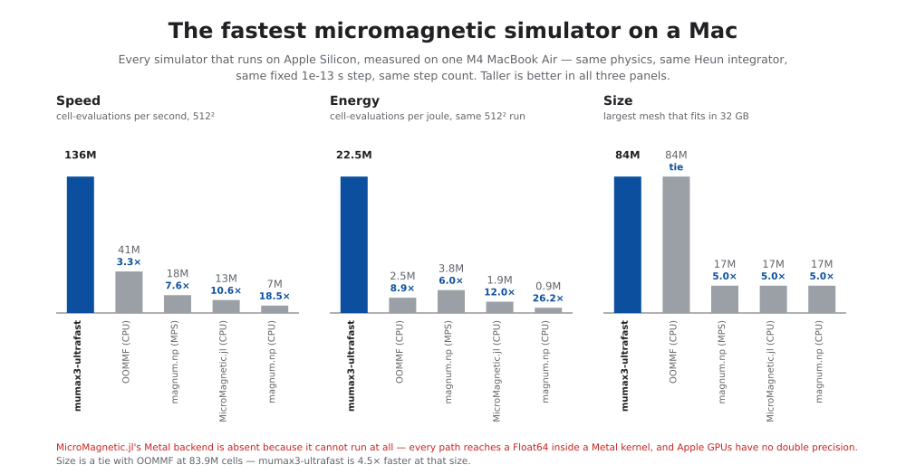
</p>

<p align="center">
  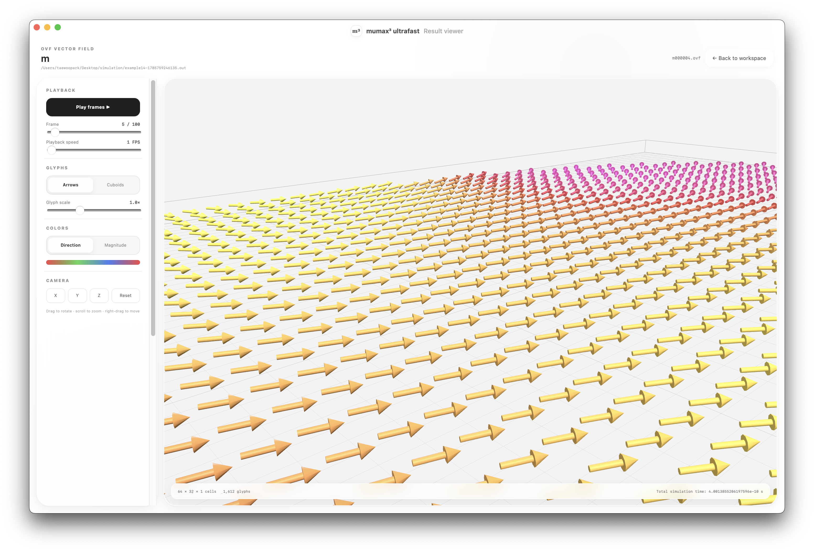<br>
  <sub>可在选装的桌面应用中直接打开已完成的模拟，并以 3D 方式旋转、缩放、变色和播放 OVF 结果。</sub>
</p>

---

## 为什么会有这个项目

在此之前，用 Mac 的物理研究者只有三个选择：另外准备一台装了 NVIDIA 显卡的 Linux 机器、租用一台，或者用 CPU 跑然后等着。

- **mumax³** 和 **mumax+** 仅支持 CUDA，无法在 Apple 硬件上运行。
- **MicroMagnetic.jl** 把 Apple GPU 列在受支持的后端里，但 0.5.0 版**在 Apple GPU 上跑不起来**。原封不动地运行它自带的 `examples/std4.jl`，会在 `Sim()` 处失败：该包默认使用 `Float64`，而 Apple GPU 没有双精度硬件。用 `set_precision(Float32)` 越过这一步之后，仍然会在 GPU 内核里失败：只含交换作用、不含退磁场的 LLG 步卡在 `gpu_fill_kernel!`，退磁张量卡在 `newell_f`。每一条路径都会在 Metal 内核中触及双精度。
- **magnum.np** 根本没有 Apple GPU 路径。`magnumnp/__init__.py` 只在 `cuda:N` 和 `cpu` 之间选择，在 import 时强制 `float64`，退磁张量也以双精度构建。要让它跑在 MPS 上需要改动三处源码。
- **OOMMF** 没有面向任何厂商的 GPU 后端。

所以 Mac 一直是微磁学计算里的二等机器。现在不必如此了。

---

## 测量结果

一台 M4 MacBook Air（10 个 GPU 核心、32 GB、无风扇），一次会话，所有模拟器求解**完全相同的问题**：退磁场 + 交换作用，固定 1e-13 秒步长的 Heun 积分，每个网格的步数也相同。因此每个参赛项每步恰好执行两次有效场计算。mumax³ 报告 `Neval = 2×steps`，OOMMF 报告 `energy_calc_count = 2×steps + 1`。

### 速度：在每个网格尺寸上都领先于每个对手

| 每秒 cell-evaluation | 128² | 256² | 512² | 1024² | 2048² |
| --- | ---: | ---: | ---: | ---: | ---: |
| **mumax3-ultrafast** | **1.61×10⁸** | **2.21×10⁸** | **1.36×10⁸** | **1.27×10⁸** | **1.17×10⁸** |
| OOMMF（CPU，8 线程） | 3.17×10⁷ | 3.91×10⁷ | 4.14×10⁷ | 3.41×10⁷ | 2.85×10⁷ |
| magnum.np（MPS，已打补丁） | 1.11×10⁷ | 2.28×10⁷ | 1.78×10⁷ | 2.63×10⁷ | 3.02×10⁷ |
| MicroMagnetic.jl（CPU） | 1.85×10⁷ | 1.62×10⁷ | 1.29×10⁷ | 1.03×10⁷ | 8.22×10⁶ |
| magnum.np（CPU，原样安装） | 7.41×10⁶ | 7.36×10⁶ | 7.36×10⁶ | 5.49×10⁶ | 4.97×10⁶ |
| MicroMagnetic.jl（Metal） | 无法运行 | 无法运行 | 无法运行 | 无法运行 | 无法运行 |

**在所有测量尺寸上，都比外部工具快 3.28 到 29.97 倍。**

<p align="center">
  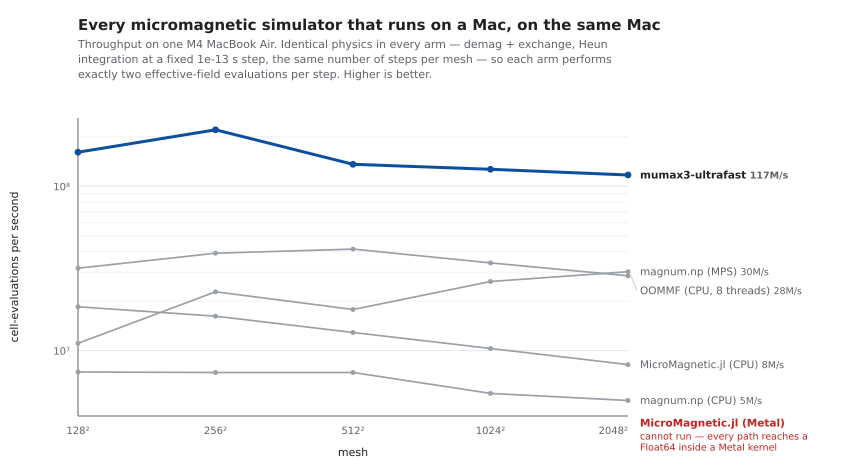
</p>

<sub>MicroMagnetic.jl 出现两次，是因为它的两个后端表现不同：CPU 后端能正常运行并被正常测量，Metal 后端则完全跑不起来。magnum.np 同样出现两次，`MPS` 是改了三处源码之后它的最佳状态，`CPU` 则是 `pip install` 的原样结果。</sub>

### 能耗：差距更大

<p align="center">
  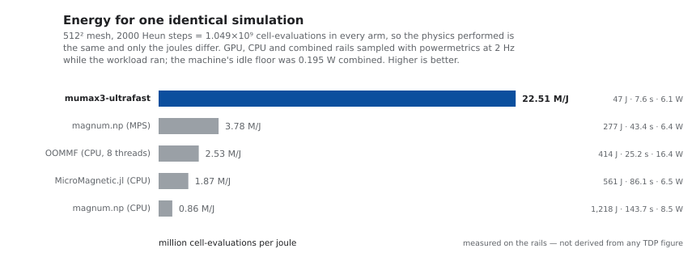
</p>

这条轴是没人能拿来跟 NVIDIA 分出高下的，因为已发表的对比都是用实测吞吐量去除以*标称板卡 TDP*，而答案会随着显卡实际吃掉多少比例的 TDP 而相差三倍。把问题限定在一台机器上，这个假设就完全消失了：所有参赛项跑在同一颗芯片上，由 `powermetrics` 采样真实的 GPU、CPU 与合计功率轨。

| | 墙钟时间 | 合计功率 | 能量 | **百万 cell-evals / J** |
| --- | ---: | ---: | ---: | ---: |
| **mumax3-ultrafast** | **7.6 s** | 6.10 W | **46.6 J** | **22.51** |
| magnum.np（MPS，已打补丁） | 43.4 s | 6.38 W | 277.1 J | 3.78 |
| OOMMF（CPU，8 线程） | 25.2 s | 16.42 W | 414.2 J | 2.53 |
| MicroMagnetic.jl（CPU） | 86.1 s | 6.51 W | 560.6 J | 1.87 |
| magnum.np（CPU，原样安装） | 143.7 s | 8.47 W | 1218.1 J | 0.86 |

<sub>512² 网格，2000 个 Heun 步，即每个参赛项 1.049×10⁹ 次 cell-evaluation。测量期间机器的空载基线为合计 0.195 W、GPU 0.002 W。</sub>

OOMMF 在时间上只落后 3.3 倍，但为此要烧掉 **16.4 W**，而 GPU 这边是 6.1 W，所以在能耗上落后 **8.9 倍**。一台无风扇笔记本以白炽灯灯丝级别的功率完成了同样的物理计算。

### 容量：笔记本上 8390 万个网格单元

<p align="center">
  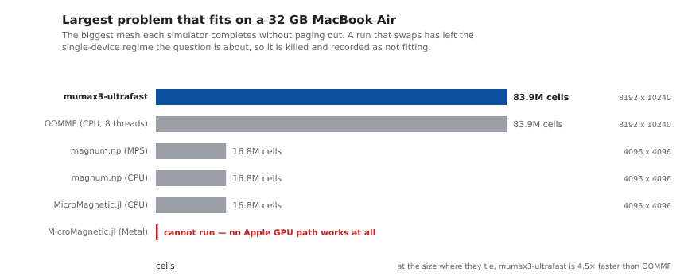
</p>

**83,886,080 个单元**（8192 × 10240，峰值 23.69 GiB）能在不发生换页的情况下跑完。按 4 nm 单元计算，这是一片 **32.8 × 41.0 µm** 的薄膜，是一整个图形化器件，而不是器件的一角。这比该平台上任何其他能用 GPU 的工具都**大 5.0 倍**。

OOMMF 也能达到同样的 8390 万，但在这个规模上 mumax3-ultrafast **快 4.5 倍**（29.2 秒对 131.1 秒）。两者在这台机器上都无法完成 1.049 亿。

### 物理：四份独立编写的代码，同一个答案

<p align="center">
  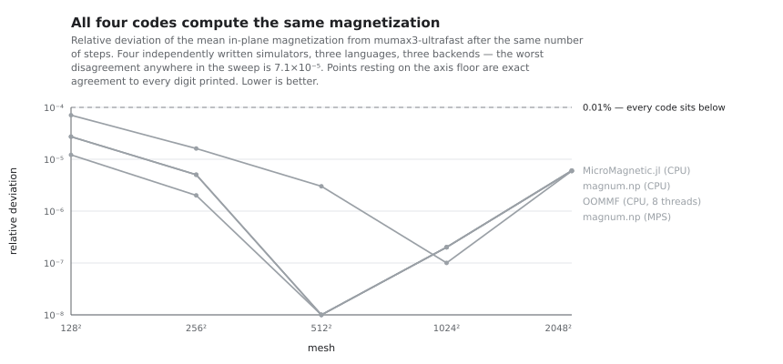
</p>

如果答案是错的，速度数字就毫无意义。上面每个参赛项都必须先通过一致性检验，其计时才算数。在相同步数之后，四份独立编写的代码（三种语言、三种后端）给出相同的平均磁化强度：

| 相同步数后的 ⟨mₓ⟩ | 512² | 1024² | 2048² |
| --- | ---: | ---: | ---: |
| mumax3-ultrafast | 0.994939 | 0.9950321 | 0.9950429 |
| OOMMF | 0.994942 | 0.9950322 | 0.9950370 |
| MicroMagnetic.jl（CPU） | 0.994939 | 0.9950319 | 0.9950369 |
| magnum.np（MPS） | 0.994939 | 0.9950319 | 0.9950370 |

整个扫描中最大的分歧为 **7.1×10⁻⁵**。

---

## 物理一致性

方程和求解器**没有被重新实现**。原生后端只是通过 Metal 执行既有的 mumax³ 物理模型，所以你引用的模型仍然是 mumax³。针对未经修改的上游 CUDA 时代回归参考的验证结果如下：

| 验证项 | 结果 |
| --- | ---: |
| 通过的非热学上游物理测试 | **15 / 15** |
| 落在上游原有容差内的断言 | **103 / 103（100.000%）** |
| 平均磁化矢量一致度（均值） | **99.9923%** |
| 平均磁化矢量一致度（最小值） | **99.9415%** |
| 零容差断言精确匹配 | **19 / 19** |
| 完成的官方 mumax³ 示例页模拟 | **15 / 15** |

这个 100% 指的是容差符合，而不是逐比特一致的主张：并行 GPU 归约在浮点数最后几位上可能不同。热学模拟使用 Philox 而非 cuRAND 的 XORWOW，因此种子在 Metal 上可复现，但不会复现 CUDA 逐样本的轨迹，改为验证其统计行为。

15 个官方示例输入与上游模板逐字节相同，其输出、日志和来源信息都已提交到仓库。

- [完整的物理验证方法与数据](physics-validation-results/apple-m4-cuda-era-20260731/)
- [官方示例、输出、来源与许可证](examples-and-results/RESULTS.md)

---

## 安装

在受支持的 Mac 上打开终端并运行：

```bash
/bin/bash -c "$(/usr/bin/curl -fsSL https://raw.githubusercontent.com/TaewoooPark/mumax3-ultrafast/main/install-macos.sh)"
```

安装程序会先在最新的 GitHub Release 中查找预编译的 Apple Silicon 引擎及其发布的 `.sha256` 文件。找到这些文件时，它会验证 SHA-256 校验和，将可执行文件安装为 `~/.local/bin/mumax3`，把该目录加入 `~/.zprofile`，最后执行 `mumax3 -test`。这条预编译安装路径不需要 Homebrew、Go、Git 或源码检出。此命令不会安装桌面应用。

如果引擎压缩包返回明确的 HTTP 404，例如指定版本的发布文件尚未上传，安装程序会自动转为源码构建，并可能安装 Apple Command Line Tools、原生 Homebrew 和 Go。网络及其他连接错误不会触发这种回退，安装程序会安全地停止。中途被打断后重新运行是安全的。

要在已有的检出目录中明确执行源码构建，请运行：

```bash
./install-macos.sh --from-source
```

安装完成后请打开一个新的终端，以便加载更新后的路径。

> [!IMPORTANT]
> 需要 Apple Silicon（M1 或更新）与 macOS 14 或更新版本。不支持 Intel Mac。配备 NVIDIA GPU 的 Linux 与 Windows 仍可使用原始的 CUDA 后端。

### 可选：桌面应用

<p align="center">
  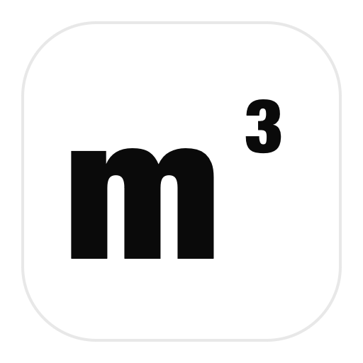
</p>

上方安装的 `mumax3-ultrafast` 引擎与命令行工作流仍是默认方案；macOS 桌面应用是在其上按需安装的可选界面。它继续以 `.mx3` 文件为唯一依据，同时提供编辑器、明确的工作文件夹选择、一键运行、实时磁化与求解器指标、运行日志，以及集成的 3D OVF 结果查看器。

无需加入 Apple Developer Program，也可以直接在这台 Mac 上构建并安装可选应用。

```bash
/bin/bash -c "$(/usr/bin/curl -fsSL https://raw.githubusercontent.com/TaewoooPark/mumax3-ultrafast/main/install-app-macos.sh)"
```

安装程序会解析最新的带标签 Release，在 `~/Library/Caches/mumax3-ultrafast` 下准备独立的 Node.js、pnpm 与 Rust 工具，然后在本机完成构建和本地 ad-hoc 签名，将应用安装为 `~/Applications/mumax3 ultrafast.app`，并安装同一版本的独立引擎。首次源码构建可能需要几分钟，之后会复用独立缓存。如果尚未安装 Apple Command Line Tools，请先完成系统弹出的安装窗口，再重新运行同一命令。更新时也只需重新运行该命令。若只想删除应用并保留引擎、构建缓存和模拟文件，请运行：

```bash
/bin/bash -c "$(/usr/bin/curl -fsSL https://raw.githubusercontent.com/TaewoooPark/mumax3-ultrafast/main/install-app-macos.sh)" -- --uninstall
```

这个本地源码构建并未经过 Apple 公证，因此在受机构管理的 Mac 上可能受到限制。如果 [GitHub Release](https://github.com/TaewoooPark/mumax3-ultrafast/releases) 中包含 `mumax3-ultrafast-app-darwin-arm64.dmg`，该文件是更快捷的已签名、公证安装方式。选项与开发流程见 [`apps/desktop/README.md`](apps/desktop/README.md)。

<table>
  <tr>
    <td width="50%" valign="top">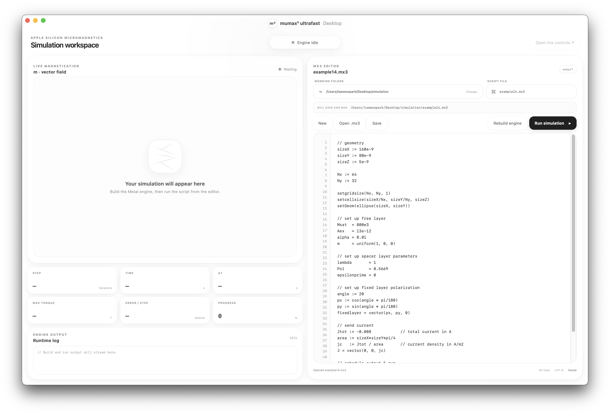<br><sub><b>脚本工作区</b> — 在所选文件夹中打开或编写 <code>.mx3</code> 文件。</sub></td>
    <td width="50%" valign="top">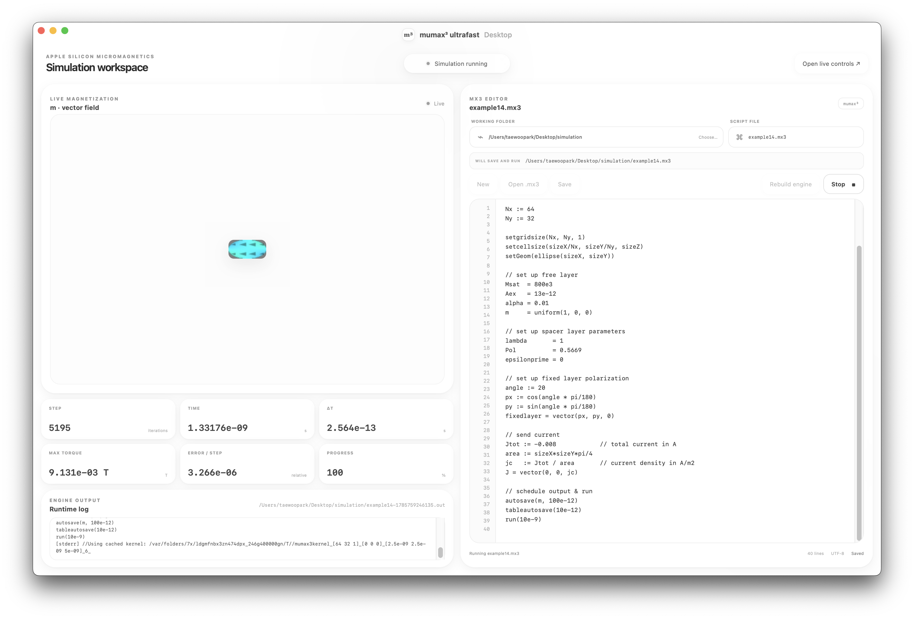<br><sub><b>实时运行</b> — 查看磁化、求解器指标、进度与日志。</sub></td>
  </tr>
  <tr>
    <td width="50%" valign="top">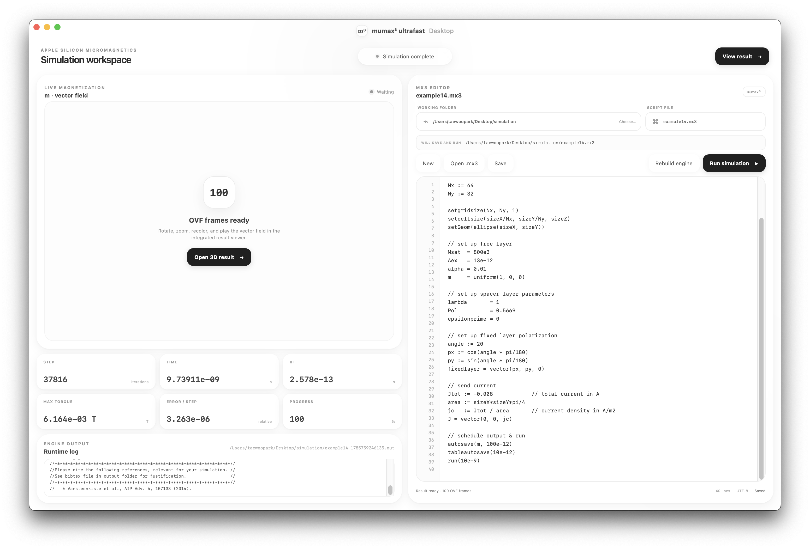<br><sub><b>结果就绪</b> — 无需离开工作区即可打开已完成任务的 OVF 帧。</sub></td>
    <td width="50%" valign="top">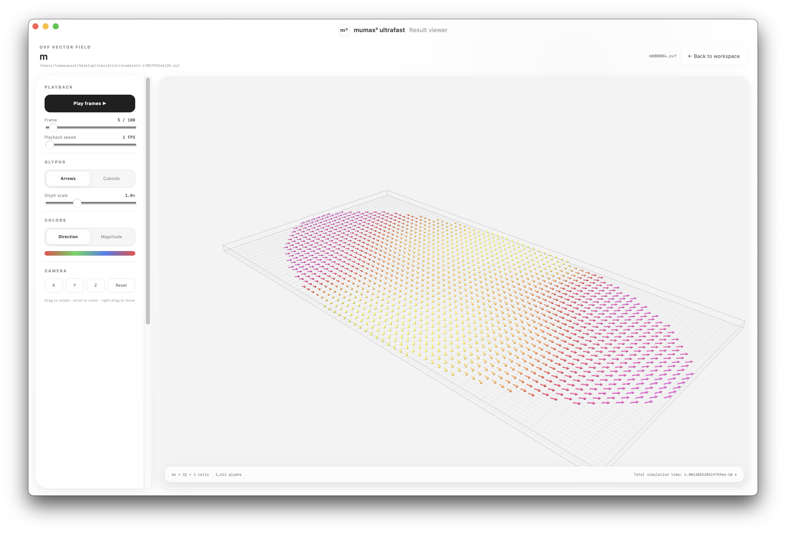<br><sub><b>3D 矢量场</b> — 旋转、平移、缩放、变色并播放结果。</sub></td>
  </tr>
  <tr>
    <td width="50%" valign="top"><br><sub><b>细节视图</b> — 切换符号样式以及方向或幅值配色。</sub></td>
    <td width="50%" valign="top">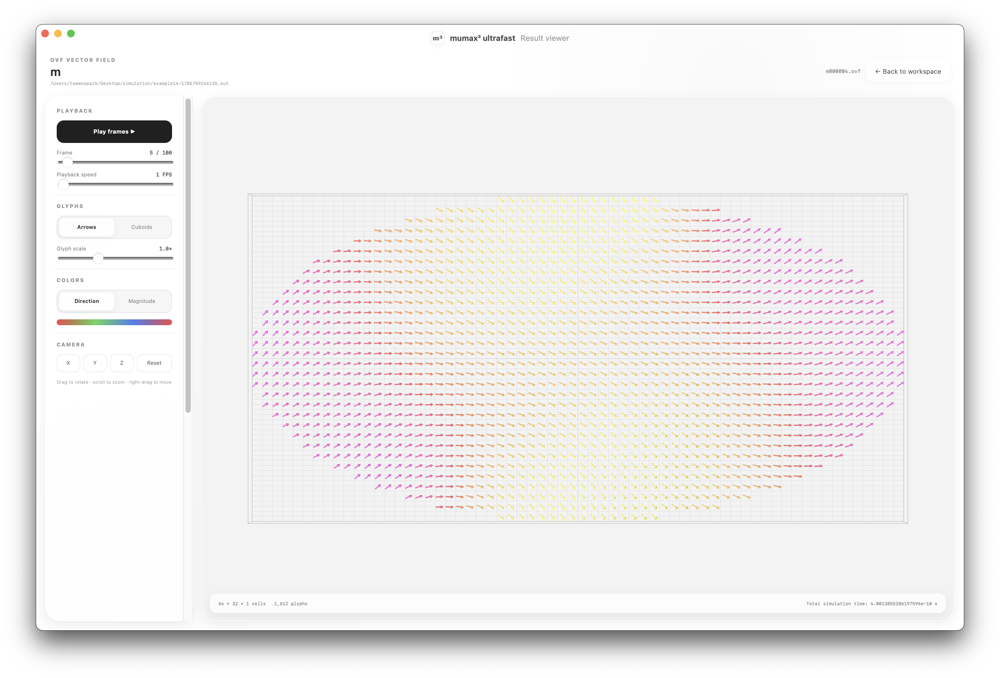<br><sub><b>俯视图</b> — 检查模拟平面内的纹理。</sub></td>
  </tr>
</table>

## 运行模拟

```bash
mumax3 example.mx3            # 实时 Web UI，地址 http://127.0.0.1:35367
mumax3 -http="" example.mx3   # 无界面模式，适用于基准测试与批处理
```

输出写入 `example.out/`。两种模式执行同一个模拟并产生相同的输出。不需要完整的 Xcode，也不需要离线 Metal 编译器，着色器库通过系统 Metal 运行时编译。

---

## 原生移植的结构

| 上游 CUDA 组件 | macOS 实现 | 保持的兼容性 |
| --- | --- | --- |
| CUDA 计算内核 | Metal 计算着色器与 Objective-C++ 运行时桥接 | 既有的 mumax³ 内核约定与 FP32 模型 |
| cuFFT | MPSGraph FFT，符合条件的二维变换另走内置的 VkFFT 路径 | 退磁卷积所用的紧凑 R2C/C2R 布局 |
| `cudaMalloc` 与 CUDA 流 | Apple 统一内存缓冲、命令批处理、单一有序 Metal 队列 | 缓冲语义与执行顺序 |
| cuRAND 热噪声 | Philox4x32-10 配合 Box–Muller 正态分布生成 | Metal 上的种子可复现性与经过验证的噪声统计 |
| 仅限 CUDA 的平台绑定 | `darwin/arm64` 构建标签与兼容垫片 | `.mx3` 语言与上层 Go API |

实现采用适合 Apple GPU 的 X 方向连续、32 宽 SIMD 分块，在阻塞式排空之间保持 GPU 常驻，把大型退磁变换按轴逐一拆分以避开 MPSGraph 调度崩塌的区间，并在运行时编译着色器，因此只装 Command Line Tools 就够了。

---

## 调优

### 受延迟限制的运行

在研究常用的网格尺寸下，Apple GPU 往往不是算力不足，而是在等待主机时空转：在 128×128 下，主机编码一个 Dormand-Prince 步所花的时间比 GPU 执行它还长。有三个开关针对这一点，且都不会改变默认构建的行为。

```go
SpeculativeStep = true   // 让主机编码与 GPU 执行重叠，实测 1.53 倍
MinimizeOnGPU   = true   // 把 minimize() 的 BB 步长留在设备上，实测 1.58 倍
```

```sh
mumax3 -j 3 sweep_*.mx3   # 每个 GPU 排队 N 个输入，三个 minimize() 任务合计实测 2.53 倍
```

`SpeculativeStep` 仍然强制 `MaxErr`，但拒绝会晚一步发生，因此时间步序列与精确控制器不同，几千步之后轨迹会出现约 1% 的偏离。在 `FixDt`、有限 `Temp`、`relax()`、`DemagExtrapolation` 以及步后钩子下，它会自行关闭。`MinimizeOnGPU` 让每一次下降保持逐比特相同，只有收敛判定晚一次迭代，所以最小化可能多走一次迭代才停下。这两个开关都建议先针对你自己的问题与默认运行做对照验证。

### Metal FFT 后端

默认情况下，对于填充后尺寸为不超过 512×512 的 2 的幂、且有效数据为严格前缀的二维退磁变换，会自动使用内置的 VkFFT 后端，其余交给 MPSGraph。`MUMAX3_METAL_FFT_BACKEND=mps` 会把所有 plan 固定在 MPSGraph 上，`vkfft` 则把 VkFFT 扩展到填充后 1024×1024 这一档。

### 可选的退磁场外推

高阶退磁场外推能加速退磁开销占比高的 4/5/6 号求解器负载，但它是一种近似，因此**默认关闭**：

```go
SetSolver(5)
DemagExtrapolation = true
```

在不受支持的求解器和不安全的模型状态下，它会安全回退到精确卷积。误差取决于轨迹与时间步长，所以在别的问题上跑通的基准并不构成精度保证。请先查看[验证结果](bench/demag-extrap/RESULTS.md)与 [A/B 方法](bench/demag-extrap/README.md)。

### 规模选择

单位网格单元的吞吐量并不随问题规模保持平坦。在实测的 M4 上，它在 256² 达到峰值；在 128² 及以下，约 172~187 µs 的固定单次计算开销占主导，此时 GPU 再宽也毫无帮助。实测曲线见 `bench/curve.txt`。

---

## 复现这些基准

以上全部内容都可以从本仓库复现，没有任何一项是建模得出的。

```bash
./bench/capacity.sh name=/path/to/binary   # Metal 限制、每单元字节数、vmmap 拆分、容量上限
python3 bench/crosstool_svg.py             # 用实测数据重新生成 README 图表
```

跨工具测试脚手架每个模拟器一份，全部用同一个积分器求解同一个问题，位于 [`crosstool/`](crosstool/)：`run_crosstool.py` 负责速度与物理，`run_energy.py` 负责 powermetrics，`run_capacity.py` 负责容量上限。让 magnum.np 跑上 Apple GPU 所需的补丁，以及在断定 MicroMagnetic.jl 的 Metal 后端无法运行之前做过哪些尝试，都写在各脚本的 docstring 中。

这里记下两条确实改变过结果的测量注意事项。换页必须通过 `vm_stat` 的 **`Swapouts`** 而不是 `Pageouts` 来监控：Apple Silicon 的内存压缩器会写入数 GB，却几乎不动 `Pageouts`。另外，mumax³ 按几何形状缓存的退磁核在这个规模下单个条目可达 8~10 GB，因此必须在两次运行之间清除。

---

## 主张的边界

刻意隐藏短板的基准毫无价值，所以如实写明：

- **在绝对速度上，本项目输给 NVIDIA。** 在 mumax³ 自己的 62 款 GPU 基准表中，M4 位于 GTX 1650 mobile 与 GTX 970 之间。把主张限定在 Apple Silicon 上是有意为之：只有在这个范围内，每一条轴都能在同一台机器上测得，无需 TDP 假设，也无需跨机器归一化。
- **容量与 OOMMF 打平。** 两者都能达到 8390 万单元，也都在 1.049 亿处失败。mumax3-ultrafast 只是在那个规模上快 4.5 倍，并不是更大。
- **相对上一个版本的领先幅度会随网格增大而收窄**：128² 为 5.4 倍，2048² 为 1.38 倍。本轮工作瞄准的是研究用网格实际所处的、受延迟限制的区间。

---

## 上游与许可证

本项目派生自 [mumax³](https://github.com/mumax/3)，其设计与验证见[原始论文](https://doi.org/10.1063/1.4899186)。使用 NVIDIA CUDA 的用户请遵循[官方 mumax³ 安装文档](https://mumax.github.io/download.html)。

本项目以 [GNU GPL v3 或更高版本](LICENSE)分发。[项目声明](NOTICE)保留了上游的 CUDA 链接许可，并标明了 macOS 侧的修改。Random123、Go、SVGo 与 Freetype-Go 的许可证与署名收录在[第三方声明](THIRD_PARTY_NOTICES.md)中。

对比对象按测量时实际安装的版本标注：[MicroMagnetic.jl](https://github.com/ww1g11/MicroMagnetic.jl) 0.5.0 搭配 Metal.jl 1.10（[arXiv:2406.16064](https://arxiv.org/abs/2406.16064)）、[magnum.np](https://gitlab.com/magnum.np/magnum.np) 2.2.0，以及 [OOMMF](https://math.nist.gov/oommf/) 2.0b0。

---

## 作者

我是**朴泰佑（Taewoo Park）**，韩国科学技术院（KAIST）物理系本科生。自 2025 年 10 月起，我在**金甲镇教授**领导的 [KAIST 超快自旋动力学实验室（USDL）](https://spintronics.kaist.ac.kr/)从事实验自旋电子学研究，方向为磁畴壁运动及其类脑计算应用。2023 年 6 月至 2024 年 3 月，我在**金世权教授**的 KAIST 量子自旋动力学实验室，通过理论建模与微磁学模拟研究磁畴壁运动。

<p align="center">
  <a href="https://github.com/TaewoooPark"></a>
  <a href="https://x.com/theoverstrcture"></a>
  <a href="https://www.linkedin.com/in/taewoo-park-427a05352"></a>
  <a href="https://taewoopark.com"></a>
  <a href="mailto:ptw151125@kaist.ac.kr"></a>
</p>

<p align="center"><sub>同样的方程，同样的脚本，同样的答案。在 Apple Silicon 上。</sub></p>
